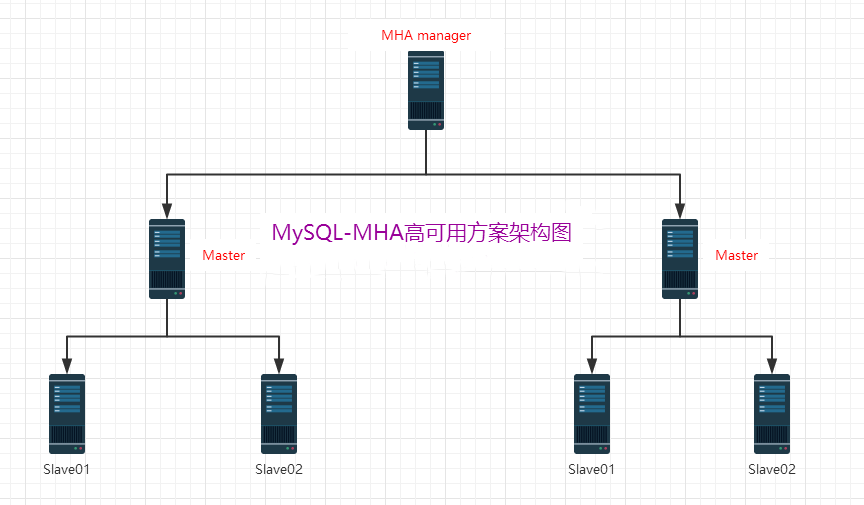

# 2.mha简介

## 2.1 软件简介

> - MHA（Master High  Availability）目前在MySQL高可用方面是一个相对成熟的解决方案，是一套优秀的作为MySQL高可用性环境下故障切换和主从提升的高可用软件。在MySQL故障切换过程中，MHA能做到0~30秒之内自动完成数据库的故障切换操作，并且在进行故障切换过程中，MHA能最大程度上保证数据库的一致性，以达到真正意义上的高可用。
> - MHA由两部分组成：MHA Manager（管理节点）和MHA Node（数据节点）。MHA  Manager可以独立部署在一台独立的机器上管理多个Master-Slave集群，也可以部署在一台Slave上。**当Master出现故障时，它可以自动将最新数据的Slave提升为新的Master，然后将所有其他的Slave重新指向新的Master。**整个故障转移过程对应程序是完全透明的。 


## 2.2 工作流程

> - 从宕机崩溃的master保存二进制日志事件（binlog events）; 
>
> - 识别含有最新更新的slave；
>
> - 应用差异的中继日志（relay log）到其他的slave；
>
> - 应用从master保存的二进制日志事件（binlog events）； 
>
> - 提升一个slave为新的master； 
>
> - 使其他的slave连接新的master进行复制。 
>
>   
>

## 2.3 MHA架构图




## 2.4 MHA工具介绍

MHA软件由两部分组成，Manager工具包和Node工具包，具体的说明如下：

```shell
#Manager工具包主要包括以下几个工具：
masterha_check_ssh #检查MHA的SSH配置状况
masterha_check_repl #检查MySQL复制状况
masterha_check_status #检测当前MHA运行状态
masterha_master_monitor #检测master是否宕机
masterha_manger #启动MHA
masterha_master_switch #控制故障转移（自动或者手动）
masterha_conf_host #添加或删除配置的server信息
masterha_secondary_check #试图建立TCP连接从远程服务器
masterha_stop #停止MHA

#Node工具包主要包括以下几个工具：
save_binary_logs #保存和复制master的二进制日志
apply_diff_relay_logs #识别差异的中继日志事件
filter_mysqlbinlog #去除不必要的ROLLBACK事件
purge_relay_logs #清除中继日志
```

